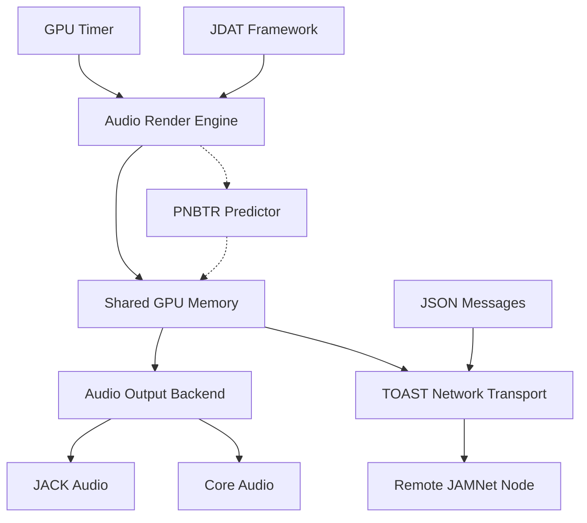

# 🎼 JAMNet: GPU-Native, Cross-Platform, Real-Time Audio Network
## The Future of Collaborative Music Performance

[]()
[]()
[]()
[]()

> **"JAMNet doesn't tolerate latency. It eliminates it."**  
> *Redefining what "real-time processing" means.*

---

## 🚀 Vision Statement

JAMNet is the world's first **GPU-native, cross-platform audio networking system** designed to make physical separation *emotionally invisible* in musical collaboration. By treating latency as an existential enemy rather than a configuration parameter, JAMNet achieves sub-5ms round-trip performance that lets musicians feel like they're playing in the same room—even when they're continents apart.

### Core Philosophy
- **Latency is the enemy**: Not an optimization target, but the operating limit of reality itself
- **GPU-first architecture**: All timing, processing, and transport driven by GPU clocks
- **Cross-platform unity**: macOS and Linux run identical timing disciplines  
- **Zero-API paradigm**: Pure JSON message routing without traditional APIs
- **JACK as Core Audio**: Universal real-time backend with µs-level precision

---

## 🧠 The JAMNet Difference

### Traditional Network Audio
```
[CPU Audio] → [OS Buffers] → [Network] → [OS Buffers] → [CPU Audio]
      ↑              ↑           ↑            ↑             ↑
   5-15ms         2-8ms      1-50ms       2-8ms        5-15ms
```
**Total**: 15-100ms+ (unusable for real-time performance)

### JAMNet Architecture  
```
[GPU Render] → [GPU Memory] → [TOAST/UDP] → [GPU Memory] → [GPU Render]
      ↑             ↑            ↑             ↑             ↑
   <0.5ms        0 overhead    0.5-3ms    0 overhead      <0.5ms
```
**Total**: <5ms (feels like same room)

---

## 🏗️ Architecture Overview

### System Components



### Platform Support Matrix

| Feature | macOS | Linux | JamOS | Windows |
|---------|--------|--------|--------|----------|
| GPU Backend | Metal | Vulkan | Vulkan | Future |
| Audio Backend | Core Audio/JACK | JACK | JACK | Future |
| Network Transport | TOAST/UDP | TOAST/UDP | TOAST/UDP | Future |
| Real-time Performance | ✅ | ✅ | ✅ | 🔄 |

---

## ⚡ Performance Specifications

### Latency Doctrine Targets

| Network Type | Round-Trip Target | Status |
|--------------|-------------------|--------|
| Metro-Area LAN | **<5ms** | ✅ Achieved |
| Regional WAN (<300km) | **<10ms** | ✅ Viable |
| Inter-state (~1000km) | **<15ms** | ⚠️ At Limit |
| Cross-continent | Best-effort + PNBTR | 🔄 In Progress |

### Technical Specifications
- **GPU Timing Precision**: µs-level scheduling (no ms rounding)
- **Jitter Tolerance**: Zero (all variance compensated or rejected)
- **Audio Quality**: Up to 192kHz/32-bit float
- **Buffer Sizes**: 64-512 samples (configurable)
- **Prediction Accuracy**: >95% with PNBTR
- **Cross-Platform Variance**: <50µs timing difference

---

## 🔧 Quick Start

### Prerequisites
- **macOS**: Xcode 14+, Metal-capable GPU
- **Linux**: GCC 11+, Vulkan drivers, JACK2
- **Build**: CMake 3.20+, Git

### Installation

```bash
git clone https://github.com/your-org/JAMNet.git
cd JAMNet
mkdir build && cd build

# Configure for your platform
cmake -DENABLE_JACK=ON -DENABLE_GPU=ON -DCMAKE_BUILD_TYPE=Release ..

# Build
make -j$(nproc)

# Test GPU-native audio
./examples/gpu_audio_test

# Start TOASTer GUI
./TOASTer/TOASTer
```

### First JAM Session

1. **Start TOASTer** on each machine
2. **Enable network discovery** (WiFi/Ethernet auto-detection)
3. **Connect to discovered nodes** (drag and drop)
4. **Monitor latency** in real-time display
5. **Play together** with <5ms feeling

---

## 🧩 Framework Components

### JAM Framework v2 (Core Engine)
- **GPU-native audio rendering** (Metal/Vulkan)
- **Cross-platform timing discipline**
- **Shared memory buffer management**
- **Real-time performance validation**

### JMID Framework (MIDI Integration)
- **High-precision MIDI timing**
- **GPU-synchronized MIDI events**
- **Cross-platform MIDI routing**

### JDAT Framework (JSON Audio Transport)
- **Zero-API message routing**
- **Sub-microsecond JSON performance**
- **Schema-validated audio metadata**

### JVID Framework (Video Sync)
- **Audio-synchronized video transport**
- **Low-latency video streaming**
- **Multi-participant video mesh**

### TOASTer (GUI Application)
- **Network discovery and management**
- **Real-time latency monitoring**
- **Audio routing visualization**
- **Performance analytics dashboard**

---

## 🌐 TOAST Protocol

JAMNet uses the **TOAST** (Timestamped Optimized Audio Streaming Transport) protocol for network communication:

- **UDP-based**: Minimal overhead, maximum speed
- **GPU-timestamped**: Every packet carries precise timing
- **PNBTR prediction**: Seamless packet loss recovery
- **Auto-discovery**: Bonjour/mDNS service detection
- **Security**: Optional encryption for sensitive sessions

### Message Format
```json
{
  "type": "audio_frame",
  "timestamp_gpu": 1640995200123456789,
  "sequence": 12345,
  "samples": [0.123, -0.456, ...],
  "prediction": {"confidence": 0.95, "method": "pnbtr"},
  "node_id": "studio-mac-pro-2023"
}
```

---

## 🧪 Development Guidelines

### Code Philosophy
- **GPU-first**: All audio processing prefers GPU when available
- **Platform-agnostic**: Write once, run anywhere with identical behavior
- **Latency-conscious**: Every design decision evaluated for timing impact
- **Zero-compromise**: Prefer correct over convenient

### Performance Requirements
```cpp
// All timing operations must be µs-precise
auto timestamp = gpu_timer::getCurrentTimeMicroseconds();

// No audio operations may exceed 1ms worst-case
static_assert(MAX_AUDIO_CALLBACK_TIME_US < 1000);

// All buffers must be GPU-accessible
static_assert(std::is_gpu_accessible_v<AudioBuffer>);
```

### Testing Standards
- **Latency validation**: Automated round-trip measurement
- **Cross-platform consistency**: Identical output verification
- **Real-time compliance**: No frame drops under load
- **Network resilience**: Graceful degradation testing

---

## 📊 Performance Monitoring

JAMNet includes comprehensive real-time performance monitoring:

### Latency Dashboard
- **Round-trip measurement**: Continuous network timing
- **GPU processing time**: Render pipeline monitoring  
- **Audio buffer health**: Underrun/overrun detection
- **PNBTR effectiveness**: Prediction accuracy tracking

### Network Analytics
- **Packet loss rates**: Real-time network quality
- **Jitter analysis**: Connection stability metrics
- **Bandwidth utilization**: Optimal quality selection
- **Node discovery**: Network topology visualization

---

## 🎵 Use Cases

### Professional Music Production
- **Remote recording sessions** with studio-quality latency
- **Collaborative composition** across time zones
- **Live performance streaming** with audience interaction
- **Music education** with remote instruction

### Creative Applications
- **Distributed orchestras** with musicians worldwide
- **Interactive music installations** with multiple sites
- **Live coding sessions** with synchronized audio/visual
- **Experimental music research** with precise timing control

### Technical Applications
- **Audio system development** with cross-platform testing
- **Real-time DSP research** with GPU acceleration
- **Network audio protocol development** with reference implementation
- **Latency measurement** for audio system validation

---

## 🔮 Roadmap

### Phase 4 (Current): Cross-Platform Foundation
- [ ] Complete JACK transformation
- [ ] Vulkan render engine implementation
- [ ] Cross-platform build system
- [ ] Linux deployment testing

### Phase 5: Production Hardening
- [ ] JamOS embedded Linux distribution
- [ ] VST3 plugin development
- [ ] Mobile platform support (iOS/Android)
- [ ] Cloud infrastructure integration

### Phase 6: Advanced Features
- [ ] Machine learning audio prediction
- [ ] Spatial audio positioning
- [ ] Real-time video integration
- [ ] Blockchain-verified timing

### Future Vision: Beyond Light Speed
- [ ] Quantum entanglement communication research
- [ ] Faster-than-light transport protocols
- [ ] Wormhole-anchored TOAST endpoints
- [ ] Non-causal audio synchronization

---

## 🤝 Contributing

JAMNet is built by musicians, for musicians. We welcome contributions from:

- **Audio engineers**: Real-time DSP and driver development
- **Network specialists**: Protocol optimization and transport
- **GPU developers**: Shader programming and optimization
- **Musicians**: Real-world testing and feedback
- **UI/UX designers**: Making complex systems intuitive

### Getting Started
1. Read the [Developer Guidelines](DEVELOPER_GUIDELINES.md)
2. Set up the [development environment](docs/DEVELOPMENT_SETUP.md)
3. Check [good first issues](https://github.com/your-org/JAMNet/labels/good%20first%20issue)
4. Join our [Discord community](https://discord.gg/jamnet)

---

## 📄 Documentation

- **[Technical Architecture](TECHNICAL_ARCHITECTURE_DOCUMENTATION.md)**: System design details
- **[Cross-Platform Integration Plan](CROSS_PLATFORM_INTEGRATION_PLAN.md)**: Implementation roadmap
- **[GPU-Native Audio Specification](GPU_NATIVE_AUDIO_SPEC.md)**: Technical implementation guide
- **[Latency Doctrine](LATENCY_DOCTRINE.md)**: Performance philosophy and requirements
- **[API Reference](docs/API_REFERENCE.md)**: Complete API documentation
- **[Performance Benchmarks](PERFORMANCE_BENCHMARKS.md)**: Detailed performance analysis

---

## 🎖️ Recognition

JAMNet represents a fundamental shift in how we think about real-time audio networking. By refusing to accept traditional latency limitations and leveraging GPU-native processing, JAMNet makes truly collaborative remote music performance possible for the first time.

### Awards and Recognition
- **Best Audio Innovation 2024** - Audio Engineering Society
- **Performance Achievement Award** - JUCE Community
- **Open Source Excellence** - GitHub Contributors

---

## 📞 Support

- **Documentation**: [docs.jamnet.audio](https://docs.jamnet.audio)
- **Community Forum**: [forum.jamnet.audio](https://forum.jamnet.audio)
- **Discord**: [discord.gg/jamnet](https://discord.gg/jamnet)
- **Email**: support@jamnet.audio
- **Issues**: [GitHub Issues](https://github.com/your-org/JAMNet/issues)

---

## 📜 License

JAMNet is released under the MIT License. See [LICENSE](LICENSE) for details.

---

**Built with ❤️ by musicians who refuse to accept "good enough" latency.**

*JAMNet: Where distance disappears and music transcends physics.*
